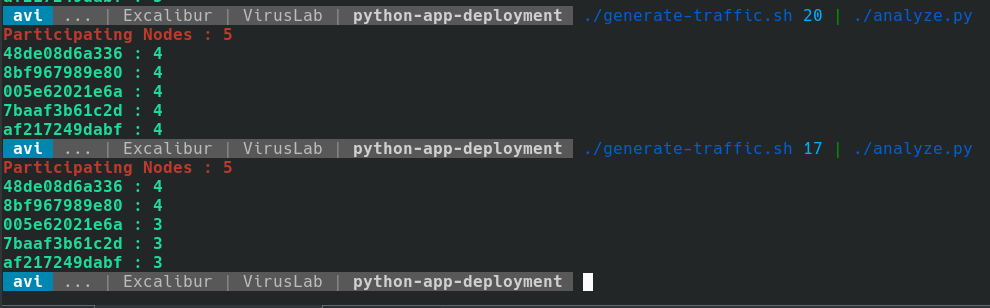

# Python App Containerized Deployment



```
# BUILD
docker build --tag avi/hello .
docker image ls

# RUN
docker run --detach --publish 4000:80 avi/hello
curl http://localhost:4000
docker container ls

# Create SERVICE - containers in production
docker swarm init
docker node ls

docker stack deploy -c docker-compose.yml getstartedlab
docker service ls
docker stack ls
docker stack ps getstartedlab
docker stack services getstartedlab


# LOAD-BALANCE and SCALE with SWARM TEST
./generate-traffic.sh 17 | ./analyze.py
```